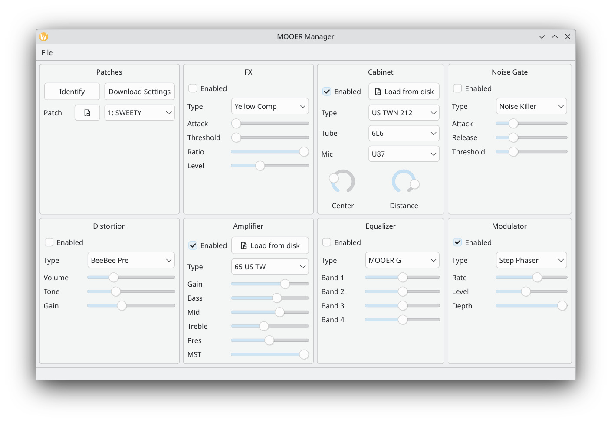
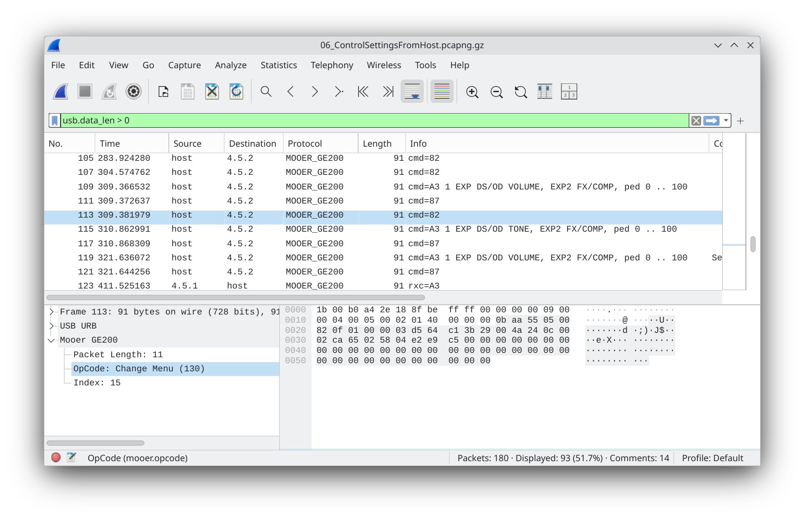

[](https://github.com/ThijsWithaar/MooerManager/actions)

# Summary

This repository contains a library and GUI to control the [Mooer GE-200](https://www.mooeraudio.com/product/GE200--48.html) guitar pedal over USB.
It's similar to [Mooer Studio](https://www.mooeraudio.com/companyfile/GE200-Downloads-138.html) provided by the manufacturer,
but this one runs on Linux as well.



## Features

- USB hotplugging: can (dis-)connect the pedal while the program is running
- Control (most) effect parameters
- Load/Save presets
- Load .amp Amplifier and .wav Cabinet simulations
- Send and Receive MIDI commands via a virtual midi port

The following MIDI commands are supported:
- Program Change: Send and receive preset change
- Control Change: Send Volume and Reverb
- SysEx: Receive arbitrary commands, see `Parser()` in [MooerParser.h](./mooer.lib/MooerParser.h) for details.


# Development notes

The main tool for figuring out the USB protocol of the Mooer GE-200 is [WireShark](https://www.wireshark.org/download.html).
The installer includes the [USBCap](https://desowin.org/usbpcap/) driver in it's installer.

Once installed, go to Help/About/Folders and look for the Lua-plugin location. Copy over the [GE200 protocol](./mooer.lua) from this archive, after which the protocol is partially decoded:



The one related project I could find was a [preset converter](https://github.com/sidekickDan/mooerMoConvert/blob/main/mooer.php)
by [sidekickDan](https://github.com/sidekickDan).


## USB connection

To list all the [endpoints](./doc/endpoints.txt):

```
sudo lsusb -v -d  0483:5703 > endpoints.txt
```

### udev and linux

Give the uses the correct rights by creating a `/etc/udev/rules.d/60-mooer.rules`. The group has to be plugdev, and the subsystem filter is singular (no 's' at the end).

```
SUBSYSTEM=="usb", ATTR{idVendor}=="0483", ATTR{idProduct}=="5703", GROUP="plugdev", MODE="0666"
```

## MIDI interface

On Linux there are ALSA, Jack, Pulseaudio and Pipewire.
Expose both Jack and Pipewire sinks, not sure which one is more popular.
The MIDI interface can be tested with [RTmidi](https://pypi.org/project/python-rtmidi) or using ALSA's `aseqdump -p 129:0`.

On Windows there are Multimedia Library, UWP and some custom drives.
To create a virtual (non-hardware) MIDI port, such that applications can connect to each other,
use a [VirtualMIDI](https://www.tobias-erichsen.de/software/virtualmidi.html) or [LoopBE1](https://www.nerds.de/en/download.html) driver.


### MIDI Protocol

[Midi.org](https://midi.org/summary-of-midi-1-0-messages) has a description of the MIDI messages. McGill has a [similar list](http://www.music.mcgill.ca/~ich/classes/mumt306/StandardMIDIfileformat.html).
